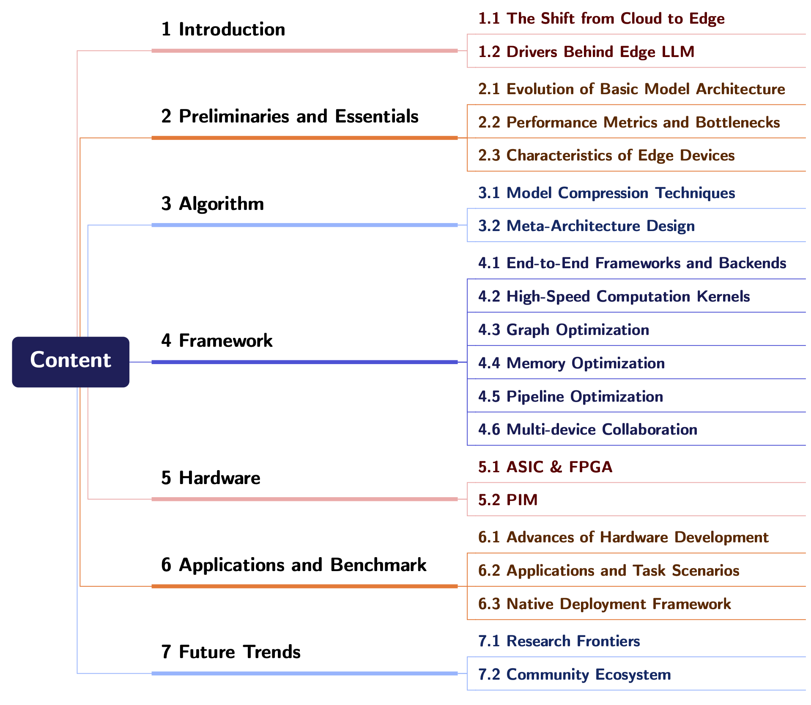

# Awesome-Edge-LLMs

 
  

## 📢 News
**May 23 2025**: A new repository accompanying the survey *Edge AI Meets LLM* (coming soon), containing a comprehensive list of papers, codebases, toolchains, and open-source frameworks. It is intended to serve as a handbook for researchers and developers interested in Edge/Mobile LLMs. 

 
<i>Figure: Timeline showcasing the evolution and emergence of Edge/Mobile LLMs, highlighting key milestones and developments in the field.</i>

<!-- ## 📊 Taxonomy

*Overview of the technical scope and content structure covered in this repository, encompassing research directions at the intersection of Edge AI and Large Language Models.* -->

<!--  -->

## Contents
[I. Open Source Frameworks and Benchmarks](docs/I-frameworks-and-benchmarks.md)
- [I.A. End-to-End Frameworks](docs/I-frameworks-and-benchmarks.md#ia-end-to-end-frameworks)
- [I.B. Performance Benchmarks](docs/I-frameworks-and-benchmarks.md#ib-performance-benchmarks)
- [I.C. Model Export Format](docs/I-frameworks-and-benchmarks.md#ic-model-export-format)

[II. Commercial Products and Cases](docs/II-commercial-products.md)
  - [II.A. Accelerators and AI Chips](docs/II-commercial-products.md#iia-accelerators-and-ai-chips)
  - [II.B. Applications and AI Agents](docs/II-commercial-products.md#iib-applications-and-ai-agents)

[III. Basic](docs/III-basic.md)
- [III.A. Typical Examples of Edge LLMs](docs/III-basic.md#iiia-typical-examples-of-edge-llms)
- [III.B. Capability on Multimodal Tasks](docs/III-basic.md#iiib-capability-on-multimodal-tasks)

IV. Algorithms (TBC)
<!-- 
[IV. Algorithms](docs/IV-algorithms.md)
- [IV.A. Model Compression Techniques](docs/IV-algorithms.md#iva-model-compression-techniques)
  - [IV.A.1. Sparsification](docs/IV-algorithms.md#iva1-sparsification)
  - [IV.A.2. Quantization](docs/IV-algorithms.md#iva2-quantization)
  - [IV.A.3. Low-rank Decomposition](docs/IV-algorithms.md#iva3-low-rank-decomposition)
- [IV.B. Meta-Architecture Design](docs/IV-algorithms.md#ivb-meta-architecture-design)
  - [IV.B.1. RNN-based](docs/IV-algorithms.md#ivb1-rnn-based)
  - [IV.B.2. Mamba](docs/IV-algorithms.md#ivb2-mamba)
  - [IV.B.3. TTT-based](docs/IV-algorithms.md#ivb3-ttt-based) -->

[V. Frameworks](docs/V-frameworks.md)
- [V.A. High-Speed Computation Kernels](docs/V-frameworks.md#va-high-speed-computation-kernels)
  - [V.A.1. Quantization Strategies and Customized Kernels](docs/V-frameworks.md#va1-quantization-strategies-and-customized-kernels)
  - [V.A.2. Sparse Storage and Computation](docs/V-frameworks.md#va2-sparse-storage-and-computation)
- [V.B. Graph Optimization](docs/V-frameworks.md#vb-graph-optimization)
  - [V.B.1. Atomic Operators Fusion](docs/V-frameworks.md#vb1-atomic-operators-fusion)
  - [V.B.2. Reuse and Sharing](docs/V-frameworks.md#vb2-reuse-and-sharing)
  - [V.B.3. Automatic Graph Generation](docs/V-frameworks.md#vb3-automatic-graph-generation)
- [V.C. Memory Optimization](docs/V-frameworks.md#vc-memory-optimization)
  - [V.C.1. Memory Reuse](docs/V-frameworks.md#vc1-memory-reuse)
  - [V.C.2. Data Locality and Access Pattern](docs/V-frameworks.md#vc2-data-locality-and-access-pattern)
  - [V.C.3. Storage Hierarchy and Offloading](docs/V-frameworks.md#vc3-storage-hierarchy-and-offloading)
- [V.D. Pipeline Optimization](docs/V-frameworks.md#vd-pipeline-optimization)
  - [V.D.1. Double Buffering](docs/V-frameworks.md#vd1-double-buffering)
  - [V.D.2. Multi-core Workload Balancing](docs/V-frameworks.md#vd2-multi-core-workload-balancing)
- [V.E. Multi-device Collaboration](docs/V-frameworks.md#ve-multi-device-collaboration)
  - [V.E.1. Heterogeneous Platforms](docs/V-frameworks.md#ve1-heterogeneous-platforms)
  - [V.E.2. Heterogeneous Computing](docs/V-frameworks.md#ve2-heterogeneous-computing)
  - [V.E.3. Cloud-Edge Collaboration](docs/V-frameworks.md#ve3-cloud-edge-collaboration)

VI. Hardware (TBC)
<!-- 
[VI. Hardware](docs/VI-hardware.md)
- [VI.A. ASIC & FPGA](docs/VI-hardware.md#via-asic--fpga)
- [VI.B. PIM](docs/VI-hardware.md#vib-pim) -->

---

<a href="#contents">👆🏻Back to Contents</a>

