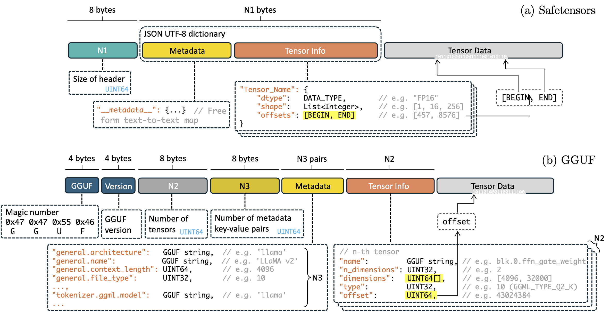

# Awesome-Edge-LLMs

 
  

A repository accompanying the survey *Edge AI Meets LLM* (coming soon), containing a comprehensive list of papers, codebases, toolchains, and open-source frameworks. It is intended to serve as a handbook for researchers and developers interested in Edge/Mobile LLMs. 

## 📢 News
**May 23 2025**: Upload a comprehensive collection about frameworks & benchmarks, commercial products & applications, models, and add papers in frameworks section. 

 
<i>Figure: Timeline showcasing the evolution and emergence of Edge/Mobile LLMs, highlighting key milestones and developments in the field.</i>

<!-- ## 📊 Taxonomy

*Overview of the technical scope and content structure covered in this repository, encompassing research directions at the intersection of Edge AI and Large Language Models.* -->

<!--  -->

## 🌈 Tags Convention

***🔗 Hyper links***: 
**Normal Paper:**  
**Official website:**  
**Github repo**:  
**Huggingface link:**  

***💡 Highlights***: **Short name:**  
**Survey**:   

## Contents

**🔨 Deployment Frameworks**

- [I. Open Source Frameworks and Benchmarks](#i-open-source-frameworks-and-benchmarks)
    - [I.A. End-to-End Frameworks](#ia-end-to-end-frameworks)
        - [I.A.1. Open Source Frameworks](#open-source-frameworks)
        - [I.A.2. Native Deployment Frameworks by Vendors](#native-deployment-frameworks-by-vendors)
    - [I.B. Performance Benchmarks](#ib-performance-benchmarks)
        - [I.B.1. General Benchmarks for Edge LLM](#ib1-general-benchmarks-for-edge-llm)
        - [I.B.2. LLM Compression Benchmarks](#ib2-llm-compression-benchmarks)
    - [I.C. Model Export Format](#ic-model-export-format)
<!-- - [More Collections](#more-collections) -->

**📱 Commercial Products and Applications**

- [II. Commercial Cases](docs/II-commercial-products.md)
    - [II.A. Downstream Applications](docs/II-commercial-products.md#iib-applications-and-ai-agents)
        - [Text Generation](docs/II-commercial-products.md#text-generation)
        - [Image Generation](docs/II-commercial-products.md#image-generation) 
        - [Intelligent Assistant](docs/II-commercial-products.md#intelligent-assistant)
    - [II.B. Accelerators and AI Chips](docs/II-commercial-products.md#iia-accelerators-and-ai-chips)
- [III. Models](docs/III-models.md)
    - [III.A. Typical Model Families](docs/III-basic.md#iiia-typical-examples-of-edge-llms)
    - [III.B. Capability on Multimodal Tasks](docs/III-basic.md#iiib-capability-on-multimodal-tasks)

<!-- - [Paper Lists](#paper-lists) -->

**[📑 Paper Lists](#paper-lists)**

- [IV. Algorithms (TBC)](docs/IV-algorithms.md)
- [V. Frameworks](docs/V-frameworks.md)
- [VI. Hardware (TBC)](docs/VI-hardware.md)

## I. Open Source Frameworks and Benchmarks
### I.A. End-to-End Frameworks

#### I.A.1. Open Source Frameworks

| Framework | Backend | Device Support | Model Family | Model Size | Organization |
|-----------|---------|----------------|--------------|------------|--------------|
| [llama.cpp](https://github.com/ggml-org/llama.cpp) | CUDA, HIP, SYCL OpenCL, MUSA, Vulkan RPC, BLAS, BLIS CANN, Metal | CPU: x86_64, ARM GPU: Intel, Nvidia, MTT, Adreno, AMD NPU: Ascend Apple Silicon | Phi, Gemma, Qwen OpenELM, MiniCPM GLM-edge | 0.5B, 1.5B | ggml |
| [ollama](https://github.com/ollama/ollama) (based on [llama.cpp](https://github.com/ggml-org/llama.cpp))  | CUDA,Metal |  CPU:x86_64, Apple-M  | DeepSeek-R1, Gemma LLaMA, Phi, Mistral LLaVA, QwQ  |  1B, 3B, 3.8B, 4B, 7B | ollama  |
| [vLLM](https://github.com/vllm-project/vllm) | CUDA, HIP SYCL, AWS Neuron | CPU: AMD, Intel, PowerPC GPU: Nvidia, AMD, Intel TPU | Gemma, Qwen, Phi, MiniCPM | 1B, 1.2B | UC Berkeley |
| [MLC-LLM](https://github.com/mlc-ai/mlc-llm) | CUDA, Vulkan OpenCL, Metal | CPU: x86_64, ARM GPU: Nvidia Apple Silicon | LLaMA | 3B | MLC |
| [MNN-LLM](https://github.com/alibaba/MNN) | HIAI, CoreML OpenCL, CUDA Vulkan, Metal | CPU: x86_64, ARM GPU: Nvidia NPU: Ascend, ANE, Apple Silicon | Qwen, Zhipu, Baichuan | 0.5B, 1B, 1.5B, 2B | Alibaba |
| [PowerInfer](https://github.com/SJTU-IPADS/PowerInfer) | CUDA, Metal | CPU: x86_64 GPU: Nvidia Apple Silicon | Falcon, Bamboo | 7B | Shanghai Jiao Tong University |
| [ExecuTorch](https://pytorch.ac.cn/executorch) | XNNPACK, Vulkan ARM Ethos-U, CoreML MediaTek, MPS CUDA, Qualcomm AI Engine Direct SDK | CPU: ARM GPU: Nvidia NPU: ANE | LLaMA | 1B, 3B | PyTorch |
| [MediaPipe](https://github.com/google-ai-edge/mediapipe) | CUDA | CPU: x86_64, ARM GPU: Nvidia | Gemma, Falcon, Phi StableLM | 1B, 2B | Google |
| [OpenPPL](https://github.com/OpenPPL/ppl.nn) | CUDA, CANN | CPU: x86_64, ARM GPU: Nvidia NPU: Ascend, Hexagon, Cambricon | ChatGLM, Baichuan, InternLM | 7B | SenseTime |
| [OpenVino](https://docs.openvino.ai) | CUDA | CPU, GPU, NPU, FPGA | Phi, Gemma, Qwen MiniCPM, GLM-edge | 0.5B, 1B | Intel |
| [ONNX Runtime](https://onnxruntime.ai) | CUDA | CPU, GPU, FPGA | Phi, LLaMA | 1B | Microsoft |
| [mllm-NPU](https://github.com/UbiquitousLearning/mllm) | CUDA, QNN | CPU: x86_64, ARM GPU: Nvidia NPU | Phi, Gemma, Qwen MiniCPM, OpenELM | 0.5B, 1B, 1.1B, 1.5B | BUPT, PKU |
| [FastLLM](https://github.com/ServiceNow/Fast-LLM) | CUDA | CPU: x86_64, ARM GPU: Nvidia | Qwen, LLaMA | 1B | ServiceNow |

#### I.A.2. Native Deployment Frameworks by Vendors

| Framework | Organization | Core Features | Links |
|-|-|-|-|
| [Qualcomm AI Engine Direct SDK](https://developer.qualcomm.com/software/qualcomm-ai-engine-direct-sdk) | Qualcomm | Backend: CPU(Kryo), GPU(Adreno), DSP(Hexagon) Device: Snapdragon 8 Gen2/3/Elite Features: Support 130+ model deployment, auto model conversion, support PyTorch/ONNX |  |
| [NeuroPilot](https://www.mediatek.com/innovations/artificial-intelligence) | MediaTek | Backend: CPU, GPU, APU Device: Dimensity series Features: Support mainstream AI frameworks, complete toolchain, support 1B-33B parameter models |  |
| [MLX](https://github.com/ml-explore/mlx) | Apple | Backend: Metal Device: M series chips Features: Unified memory architecture, support text/image generation, low power consumption |   |
| [Google AI Edge SDK](https://ai.google.dev/tutorials/android_edge_sdk_quickstart) | Google | Backend: TPU Device: Tensor G series Features: Fast integration of AI capabilities |  |
| [TensorRT-LLM](https://github.com/NVIDIA/TensorRT-LLM) | NVIDIA | Backend: CUDA Device: Jetson series Features: Dynamic batching, paged KV cache, quantization, speculative decoding |  |
| [OpenVINO](https://github.com/openvinotoolkit/openvino) | Intel | Backend: CPU, GPU, VPU Device: Intel processors/graphics Features: Hardware-algorithm co-optimization |   |

<a href="#contents">👆🏻Back to Contents</a>

### I.B. Performance Benchmarks 

#### I.B.1. General Benchmarks for Edge LLM
- Open LLM Leaderboard for Edge Devices 

- Open LLM Leaderboard for Consumers 

#### I.B.2. LLM Compression Benchmarks
- LLM Compression Benchmark 
- LLMCBench  

<a href="#contents">👆🏻Back to Contents</a>

### I.C. Model Export Format

| Format | Safe | Zero-copy | Lazy loading | No file size limit | Layout control | Flexibility | Bfloat16/Fp8 |
|--------|------|-----------|--------------|-------------------|----------------|-------------|---------------|
| GGUF (ggml-org)               | ✔️ | ✔️ | ✔️ | ~ | ~ | ✔️ | ✔️ | 
| pickle (PyTorch)  | ✗ | ✗ | ✗ | ✔️ | ✗ | ✔️ | ✔️ |
| H5 (Tensorflow)  | ✔️ | ✗ | ✔️ | ✔️ | ~ | ~ | ✗ |
| SavedModel (Tensorflow)  | ✔️ | ✗ | ✗ | ✔️ | ✔️ | ✗ | ✔️ |
| MsgPack (flax)  | ✔️ | ✔️ | ✗ | ✔️ | ✗ | ✗ | ✔️ |
| Protobuf (ONNX)   | ✔️ | ✗ | ✗ | ✗ | ✗ | ✗ | ✔️ |
| Cap'n'Proto   | ✔️ | ✔️ | ~ | ✔️ | ✔️ | ~ | ✗ |
| llamafile (Mozilla)  |  ✔️| ✗ | ✗ | ✗ | ~ | ~ | ✔️ |
| Numpy (npy,npz)   | ✔️ | ? | ? | ✗ | ✔️ | ✗ | ✗ |
| pdparams (Paddle)  | ✗ | ✗ | ✗ | ✔️ | ✗ | ✔️ | ✔️ |
| SafeTensors   | ✔️ | ✔️ | ✔️ | ✔️ | ✔️ | ✗ | ✔️ |

> 💡 **Note**: This table is taken from [safetensors git repository](https://github.com/huggingface/safetensors?tab=readme-ov-file#yet-another-format-), and more detailed information can be found there.

 
<i>Figure: File format illustrations reference <a href="https://huggingface.co/datasets/huggingface/documentation-images/resolve/main/safetensors/safetensors-format.svg">safetensors</a> and <a href="https://huggingface.co/datasets/huggingface/documentation-images/resolve/main/hub/gguf-spec.png">GGUF</a>.</i>

<a href="#contents">👆🏻Back to Contents</a>

<!-- ## Commercial Products and Applications

[II. Commercial Products and Cases](docs/II-commercial-products.md)
  - [II.A. Applications and AI Agents](docs/II-commercial-products.md#iib-applications-and-ai-agents)
    - [Text Generation](docs/II-commercial-products.md#text-generation)
    - [Image Generation](docs/II-commercial-products.md#image-generation) 
    - [Intelligent Assistant](docs/II-commercial-products.md#intelligent-assistant)
  - [II.B. Accelerators and AI Chips](docs/II-commercial-products.md#iia-accelerators-and-ai-chips)

[III. Models](docs/III-models.md)
- [III.A. Typical Model Families](docs/III-basic.md#iiia-typical-examples-of-edge-llms)
- [III.B. Capability on Multimodal Tasks](docs/III-basic.md#iiib-capability-on-multimodal-tasks)

<a href="#contents">👆🏻Back to Contents</a>

 -->

## Paper Lists

[IV. Algorithms (TBC)](docs/IV-algorithms.md)
<!-- 
[IV. Algorithms](docs/IV-algorithms.md)
- [IV.A. Model Compression Techniques](docs/IV-algorithms.md#iva-model-compression-techniques)
  - [IV.A.1. Sparsification](docs/IV-algorithms.md#iva1-sparsification)
  - [IV.A.2. Quantization](docs/IV-algorithms.md#iva2-quantization)
  - [IV.A.3. Low-rank Decomposition](docs/IV-algorithms.md#iva3-low-rank-decomposition)
- [IV.B. Meta-Architecture Design](docs/IV-algorithms.md#ivb-meta-architecture-design)
  - [IV.B.1. RNN-based](docs/IV-algorithms.md#ivb1-rnn-based)
  - [IV.B.2. Mamba](docs/IV-algorithms.md#ivb2-mamba)
  - [IV.B.3. TTT-based](docs/IV-algorithms.md#ivb3-ttt-based) -->

[V. Frameworks](docs/V-frameworks.md)
- [V.A. High-Speed Computation Kernels](docs/V-frameworks.md#va-high-speed-computation-kernels)
  - [V.A.1. Quantization Strategies and Customized Kernels](docs/V-frameworks.md#va1-quantization-strategies-and-customized-kernels)
  - [V.A.2. Sparse Storage and Computation](docs/V-frameworks.md#va2-sparse-storage-and-computation)
- [V.B. Graph Optimization](docs/V-frameworks.md#vb-graph-optimization)
  - [V.B.1. Atomic Operators Fusion](docs/V-frameworks.md#vb1-atomic-operators-fusion)
  - [V.B.2. Reuse and Sharing](docs/V-frameworks.md#vb2-reuse-and-sharing)
  - [V.B.3. Automatic Graph Generation](docs/V-frameworks.md#vb3-automatic-graph-generation)
- [V.C. Memory Optimization](docs/V-frameworks.md#vc-memory-optimization)
  - [V.C.1. Memory Reuse](docs/V-frameworks.md#vc1-memory-reuse)
  - [V.C.2. Data Locality and Access Pattern](docs/V-frameworks.md#vc2-data-locality-and-access-pattern)
  - [V.C.3. Storage Hierarchy and Offloading](docs/V-frameworks.md#vc3-storage-hierarchy-and-offloading)
- [V.D. Pipeline Optimization](docs/V-frameworks.md#vd-pipeline-optimization)
  - [V.D.1. Double Buffering](docs/V-frameworks.md#vd1-double-buffering)
  - [V.D.2. Multi-core Workload Balancing](docs/V-frameworks.md#vd2-multi-core-workload-balancing)
- [V.E. Multi-device Collaboration](docs/V-frameworks.md#ve-multi-device-collaboration)
  - [V.E.1. Heterogeneous Platforms](docs/V-frameworks.md#ve1-heterogeneous-platforms)
  - [V.E.2. Heterogeneous Computing](docs/V-frameworks.md#ve2-heterogeneous-computing)
- [V.F. Cloud-Edge Collaboration](docs/V-frameworks.md#vf-cloud-edge-collaboration)
  - [V.F.1. Separate Model Deployment](docs/V-frameworks.md#vf31-separate-model-deployment)
  - [V.F.2. Partitioned Model Deployment](docs/V-frameworks.md#vf32-partitioned-model-deployment)

[VI. Hardware (TBC)](docs/VI-hardware.md)
<!-- 
[VI. Hardware](docs/VI-hardware.md)
- [VI.A. ASIC & FPGA](docs/VI-hardware.md#via-asic--fpga)
- [VI.B. PIM](docs/VI-hardware.md#vib-pim) -->

## 📄 License

This project is open-source and available under the MIT License. See the [LICENSE](LICENSE) file for more details.

<a href="#contents">👆🏻Back to Contents</a>

